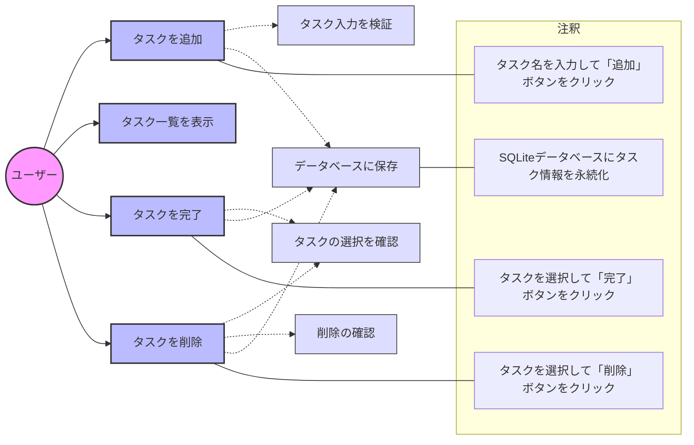

## ユースケース図の説明

### アクター
- ユーザー：システムを利用する人

### メインユースケース
1. タスクを追加
   - タスク名を入力して新しいタスクを作成
2. タスク一覧を表示
   - 登録されているタスクの一覧を表示
3. タスクを完了
   - 選択したタスクを完了状態に変更
4. タスクを削除
   - 選択したタスクをシステムから削除

### サブユースケース（<<include>>）
1. タスク入力を検証
   - 入力値の妥当性をチェック
2. タスクの選択を確認
   - タスクが選択されているか確認
3. 削除の確認
   - 削除前に確認ダイアログを表示
4. データベースに保存
   - タスク情報をSQLiteに永続化 